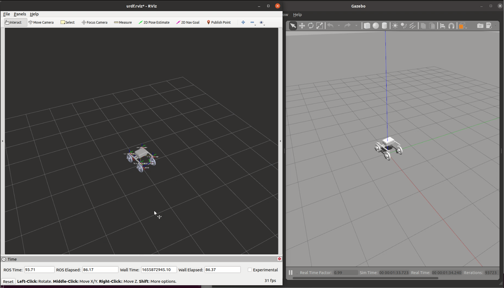
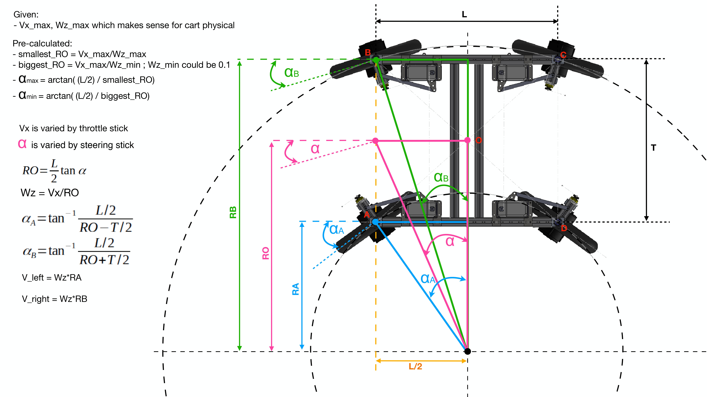
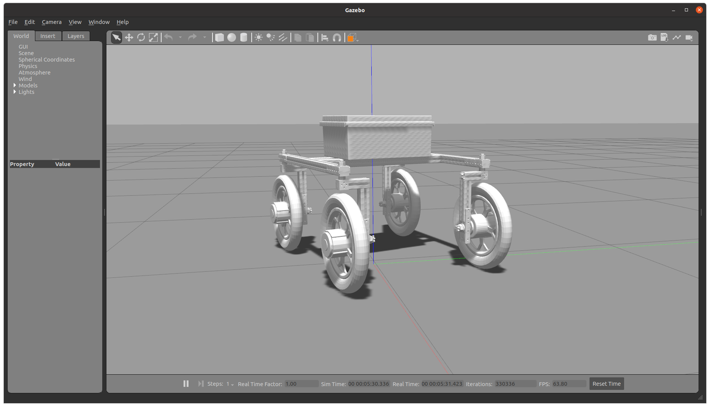
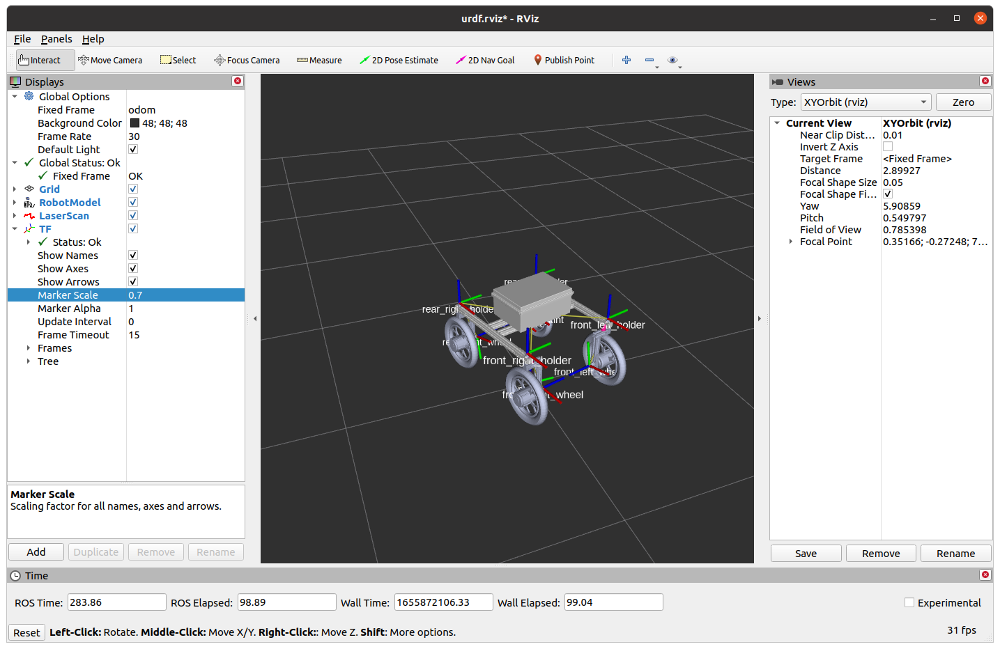
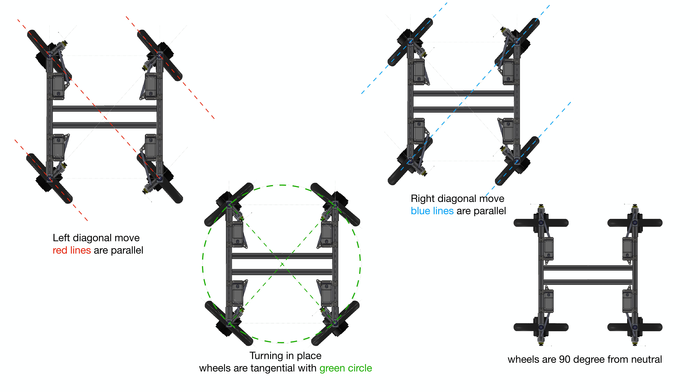

# ATCart-Omni-Gazebo

This is a simulation model of ATCart-Omni in gazebo with ROS control.

[](https://youtu.be/rWcC73BFL28)

## Mathematics

All of the wheels can be controlled individually, so we can use double-ankermann equation to find the right angles of servo (steering) and right amount of velocities to drive each wheel.




## Run

Run the commands below to start the robot in gazebo
```sh
## Terminal1
## launch main gazebo world with the robot
roslaunch atcart_omni_gazebo gazebo.launch

## Terminal2
## run joy_node to control cart interactively
## please install joy node before
rosrun joy joy_node

## Terminal3
## run omni_control.py to control joints
rosrun atcart_omni_gazebo omni_control.py

```



Additionally, we can visualize the data in Rviz as well

```sh
## Terminal4
roslaunch atcart_omni_gazebo display.launch
```


I am using Logicool F310 gamepad, so the buttons are assigned to let user drive the cart in different mode as below

- Double-Ankermann steering mode: left analog (up-down) for throttle, right analog (left-right) for steering

- Left diagonal movement: press holding LB button, then left analog (up-down) for throttle

- Right diagonal movement: press holding RB button, then left analog (up-down) for throttle

- Sided-way movement: press holding Y button, then left analog (up-down) for throttle

- Turning in place movement: press holding X button, then left analog (up-down) for throttle

